# Лабораторная работа №3 - REST API, Gateway и синхронный обмен между микросервисами

Цель: изучение шаблона проектирования gateway, построения синхронного обмена между микросервисами и архитектурного стиля RESTful API.

Задачи:

Создать 2 микросервиса, реализующих CRUD на связанных сущностях.
Реализовать механизм синхронного обмена сообщениями между микросервисами.
Реализовать шлюз на основе прозрачного прокси-сервера nginx.

# Создание микросервисов
Первый микросервис - messaging-application для сущности "Приложение для обмена сообщениями"
Второй микросервис - user-device-application для сущности "Устройство пользователя"

Сущность: Устройство пользователя (User Device):
UUID (Уникальный идентификатор): Уникальный номер или код, идентифицирующий конкретное устройство пользователя.
Модель (Model): Название и модель устройства пользователя.
Тип интерфейса (Interface Type): Тип интерфейса для подключения к веб-приложению (Web, Mobile, Desktop и т.д.).
UUID приложения для обмена сообщениями (messagingAppUuid): Уникальный идентификатор приложения для обмена сообщениями, с которым данное устройство пользователя связано. Это поле устанавливает связь "1-ко-многим" между устройством и приложением.

Сущность: Приложение для обмена сообщениями (Messaging Application):
UUID (Уникальный идентификатор): Уникальный номер или код, идентифицирующий конкретное приложение для обмена сообщениями.
Название (Name): Название приложения для обмена сообщениями.
Поддерживаемые платформы (Supported Platforms): Операционные системы и устройства, на которых работает приложение (Web, Mobile, Desktop и др.).
Максимальное количество участников (Maximum Participants): Максимальное количество пользователей, которое может использовать приложение для обмена сообщениями одновременно.

Связь "1-ко-многим" между этими сущностями реализуется через поле "UUID приложения" в сущности "Устройство пользователя". Каждое устройство пользователя связано с конкретным приложением для обмена сообщениями через UUID этого приложения, что позволяет одному приложению быть связанным с несколькими устройствами.

Вот примеры моделей для запросов:
Пример модели "Приложение для обмена сообщениями" для списка:
{
    "uuid": "8f036445-a5bd-401c-926e-840f9de795cd",
    "Name": "Messenger",
    "Supported Platforms": "Web, iOS, Android",
    "Maximum Participants": 100
}
Пример модели "Приложение для обмена сообщениями" для создания или изменения:
{
    "uuid": "8f036445-a5bd-401c-926e-840f9de795cd",
    "Name": "Messenger",
    "Supported Platforms": "Web, iOS, Android",
    "Maximum Participants": 100
}
Пример модели "Устройство пользователя" для списка:
{
    "uuid": "8740d660-b251-4272-8535-be7ec3748d4b",
    "Model": "iPhone X",
    "type": "Mobile",
    "Interface Type": "ios",
    "messagingAppUuid": "8f036445-a5bd-401c-926e-840f9de795cd"
}

Пример модели "Устройство пользователя" для создания или изменения:
{
    "Model": "iPhone X",
    "type": "Mobile",
    "Interface Type": "ios",
    "messagingAppUuid": "8f036445-a5bd-401c-926e-840f9de795cd"
}
Пример модели "Устройство пользователя" для подробностей:
{
    "uuid": "8740d660-b251-4272-8535-be7ec3748d4b",
    "Model": "iPhone X",
    "type": "Mobile",
    "Interface Type": "ios",
    "messagingAppUuid": "8f036445-a5bd-401c-926e-840f9de795cd",
    "messagingAppInfo": {
        "Name": "Messenger",
        "Supported Platforms": "Web, iOS, Android",
        "Maximum Participants": 100
    }
}

    
Структура 1-го микросервиса

    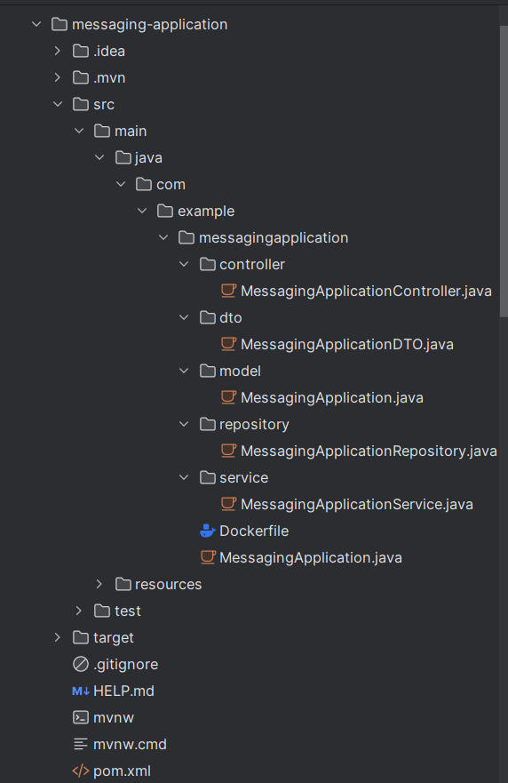

    
Структура 2-го микросервиса

    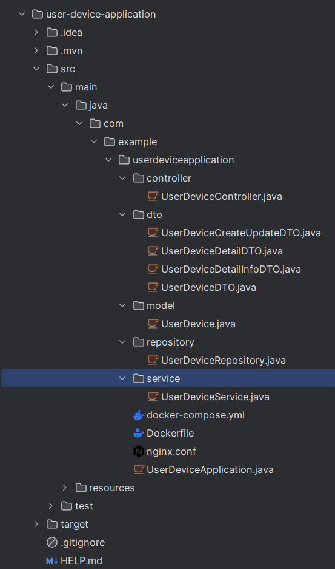

- контроллеры для обработка запросов, дтошки для выбора что изображать в сваггере при запросах, модели для сущностей, репозитории для отправки данных, сервисы для бизнес-логики

# Докер файлы, докер компоус, nginx

    
Докер файл для 1-го микросервиса

    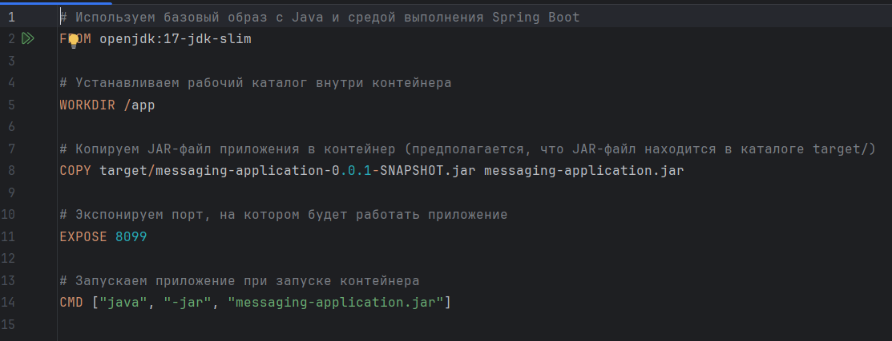

    
Докер файл для 2-го микросервиса

    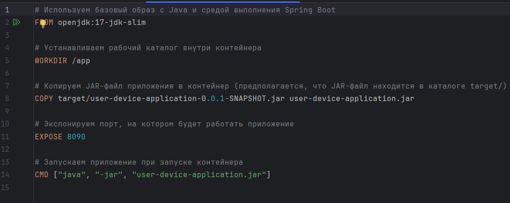

-Использования базового образа, установка рабочий директории, копирования джар файла, экспорт порта, запуск приложения при запуске контейнера

    
Докер компоус

    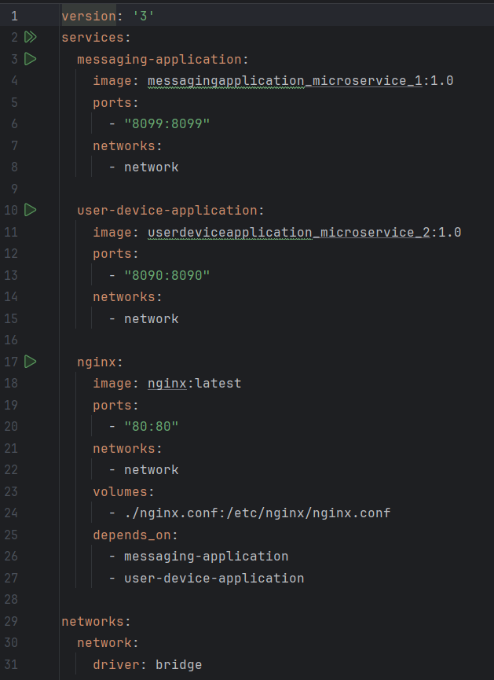

-создания общей сети для всех сервисов, запуск образов сервисов, проброска портов, копирования конфигурационного файла nginx и запуск этого сервиса после запуска других сервисов 

    
nginx

    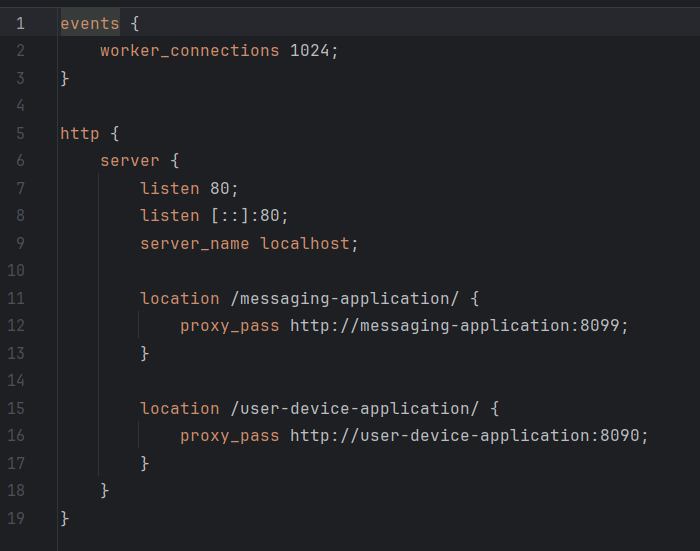

установка количества одновремменных подключений, прослушка запросов по 80 порту, серверное имя локалхост, адрес для переадресации запросов по нему, url переадрусации

    
Скрин созданых образов

    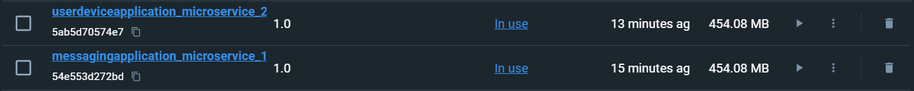

    
Скрин созданых контейнеров

    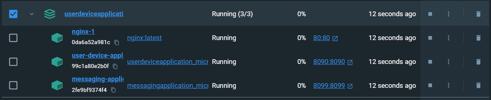

    
Swagger 1-го микросервиса

    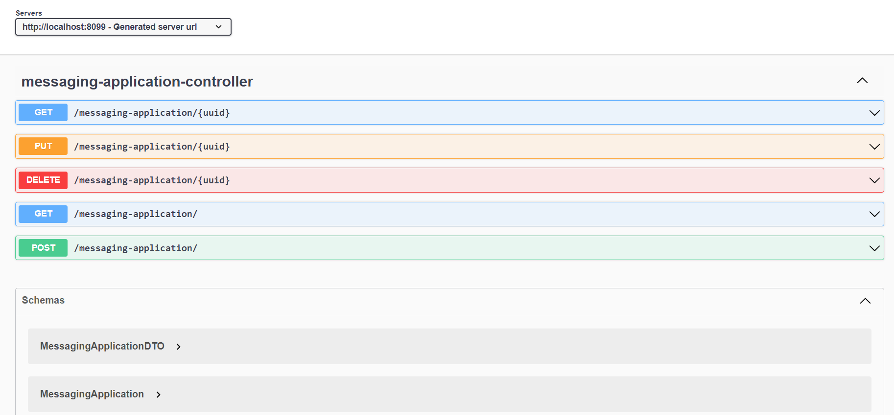

    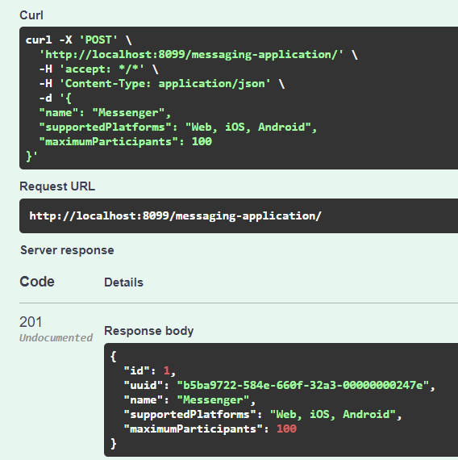

    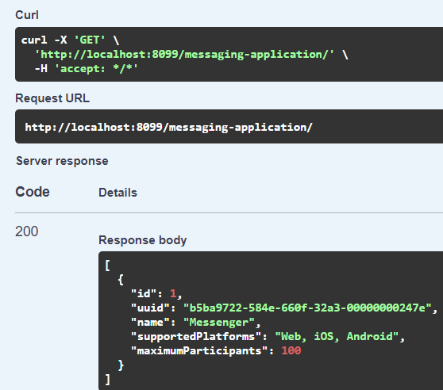

    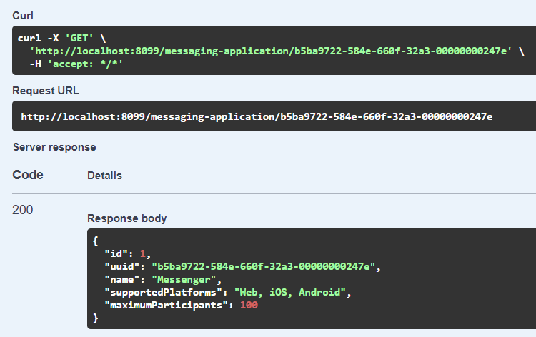

    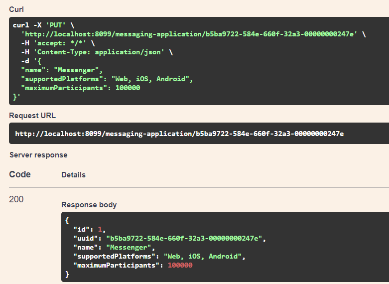

    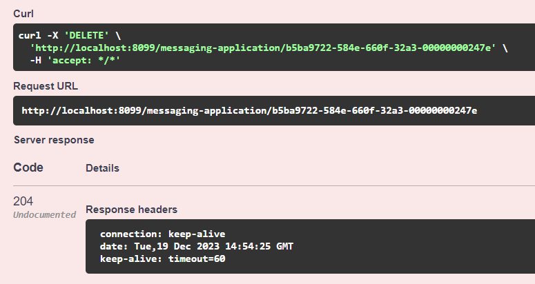

    
Swagger 2-го микросервиса

    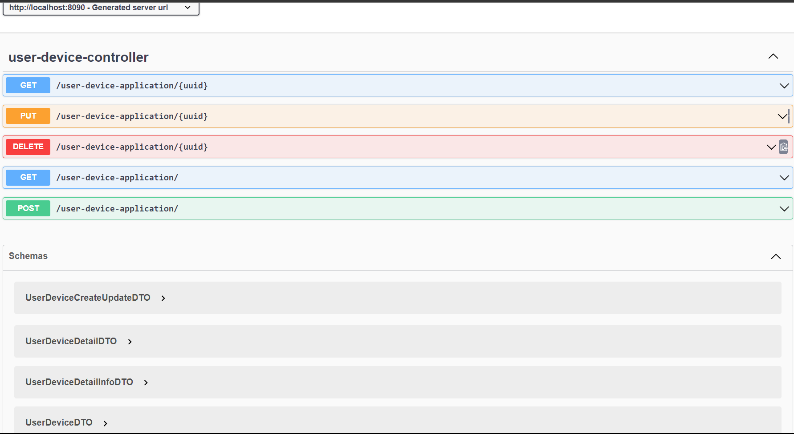

    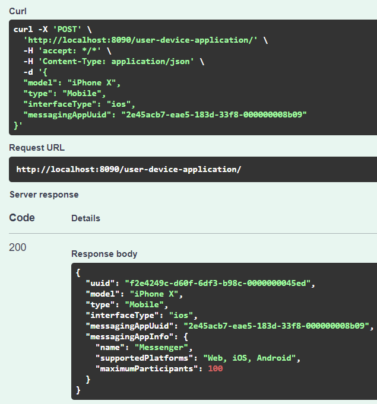

    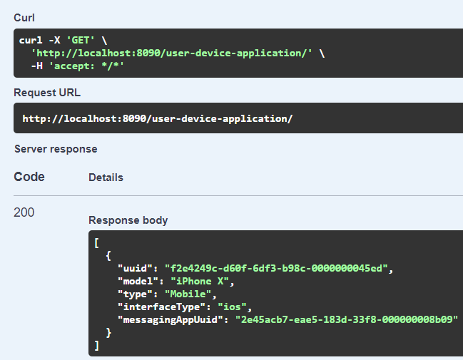

    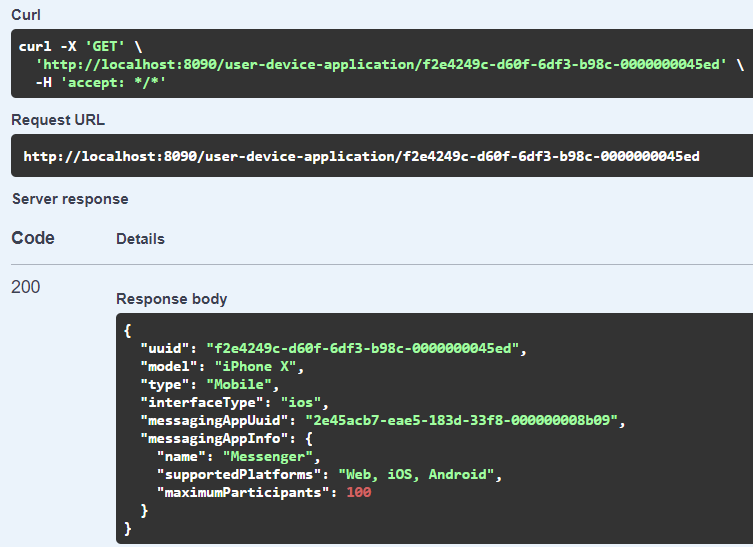

    

    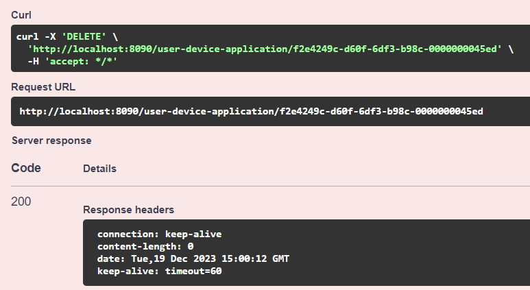

# Видео

Видео с разбором лабораторной работы - https://disk.yandex.ru/i/1fozjsejhqbXcw
